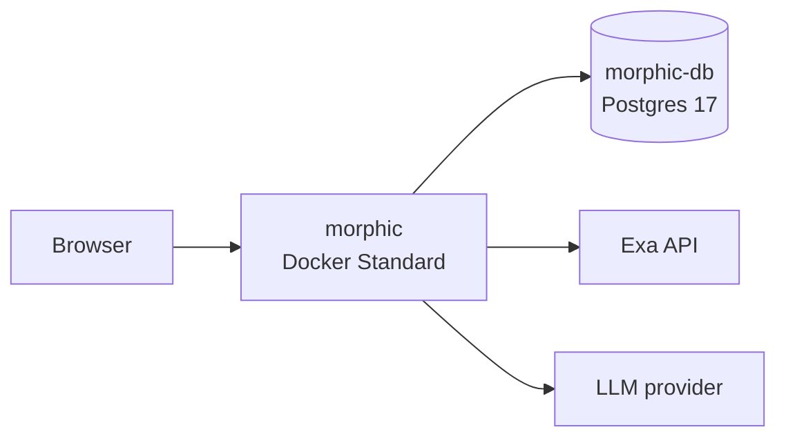

<div align="center">

# Morphic on Render

Deploy **Morphic**, an AI answer engine with generative UI and citations, on Render with Docker, managed Postgres, and Exa neural search.

<p>
  <a href="https://render.com/deploy-template/api/github/start?template_repo=morphic">
    
  </a>
</p>

<p>
  <a href="https://render.com">
    
  </a>
  <a href="https://github.com/miurla/morphic">
    
  </a>
  <a href="https://exa.ai/">
    
  </a>
</p>

</div>


## What This Template Shows

This repo packages [Morphic](https://github.com/miurla/morphic) as a Render Blueprint (docker-fork): builds from `./Dockerfile`, wires managed Postgres for chat history, and uses Exa instead of self-hosted SearXNG/Redis.

| Piece | Role |
| --- | --- |
| **[Morphic](https://github.com/miurla/morphic)** | Generative UI answer engine |
| **[Render Web Service](https://render.com/docs/web-services)** | Docker Next.js app (`standard`) |
| **[Render Postgres](https://render.com/docs/postgresql)** | Chat history (`morphic-db`) |
| **[Exa](https://exa.ai/)** | Neural web search (`SEARCH_API=exa`) |
| **LLM provider** | Completions (OpenAI / Anthropic / Google / …) |

## Architecture



### How It Works

1. Click **Deploy to Render**. Render forks this template and applies [`render.yaml`](./render.yaml).
2. Enter `EXA_API_KEY` on Apply. Add one LLM key on Apply or after deploy on the service.
3. Render builds the Docker image (Next.js) and runs migrations on container start.
4. Open the `morphic` `*.onrender.com` URL and ask a question.
5. Chat history persists in Postgres across deploys.

| Resource | Type | Plan | Notes |
| --- | --- | --- | --- |
| `morphic` | Web (`runtime: docker`) | **standard** | Health `/`; migrations on boot |
| `morphic-db` | Postgres 17 | **basic-256mb** | Private (`ipAllowList: []`) |
| `morphic-render` | Env group |  | Shared non-secret config |

Default region: **oregon**. Previews are off. **Standard is the floor**: Starter (512 MB) typically OOMs during the Next.js build/start ("No open ports detected").

## Quick Start

### Prerequisites

- A [Render account](https://dashboard.render.com/register?utm_source=github&utm_medium=referral&utm_campaign=ojus_demos&utm_content=readme_link)
- An [Exa API key](https://dashboard.exa.ai/)
- At least one LLM key (OpenAI, Anthropic, Gemini, or AI Gateway)

### Deploy

1. Click **Deploy to Render** above and fork into your GitHub account.
2. On Apply, enter `EXA_API_KEY`. Optionally paste an LLM key now.
3. Wait until **Live** (~5–10 minutes first time).
4. Open the public URL. If the model selector is empty, add an LLM key on the service and retry.
5. Run a query and confirm citations stream back.

Smoke test:

```bash
curl -sS -o /dev/null -w "%{http_code}\n" https://<your-morphic>.onrender.com/
```

## Features

| Feature | Description |
| --- | --- |
| **Docker fork** | Builds from `./Dockerfile` (no public Morphic image required) |
| **Exa search** | Replaces self-hosted SearXNG in Compose |
| **Managed Postgres** | `DATABASE_URL` wired via `fromDatabase` |
| **Anonymous mode** | `ENABLE_AUTH=false` by default |
| **One Render project** | `projects` / `environments` wrapper |

## Configuration

| Variable | Source | Description |
| --- | --- | --- |
| `EXA_API_KEY` | Required (`sync: false`) | Exa neural search |
| `DATABASE_URL` / `DATABASE_RESTRICTED_URL` | Wired | From `morphic-db` |
| `NODE_ENV` | Wired (group) | `production` |
| `ENABLE_AUTH` | Wired (group) | `false` |
| `ANONYMOUS_USER_ID` | Wired (group) | `anonymous-user` |
| `SEARCH_API` | Wired (group) | `exa` |
| `NODE_TLS_REJECT_UNAUTHORIZED` | Wired (group) | `0` (Render Postgres TLS with upstream Node) |
| `OPENAI_API_KEY` / `ANTHROPIC_API_KEY` / `GOOGLE_GENERATIVE_AI_API_KEY` / `AI_GATEWAY_API_KEY` | Optional (Dashboard) | Add at least one LLM key after deploy |

Upstream config: [CONFIGURATION.md](https://github.com/miurla/morphic/blob/main/docs/CONFIGURATION.md).

## Cost

| Resource | Approx. monthly |
| --- | ---: |
| Web (Standard) | ~$25 |
| Postgres (`basic-256mb`) | ~$6 |
| **Total** | **~$31** |

Exa and LLM usage are billed by those providers. Do not drop the web plan to Starter unless you have proven the build fits in 512 MB.

## Troubleshooting

| Problem | Solution |
| --- | --- |
| Health check fails / no open ports | Keep **Standard**. Check build logs for OOM. |
| Model selector empty | Add an LLM key on the service Environment. |
| Search errors | Confirm `EXA_API_KEY` and `SEARCH_API=exa`. |
| Postgres TLS / certificate errors | Keep `NODE_TLS_REJECT_UNAUTHORIZED=0` from the env group. |
| Empty chat history | Confirm `DATABASE_URL` wiring and Postgres is Live. |

## Project Structure

```
render.yaml       Render Blueprint (Docker web + Postgres)
README.md         This file
LICENSE           MIT (template packaging note) / upstream Apache-2.0 for app
Dockerfile        App image build
app/ …            Morphic source (docker-fork)
assets/           Hero / logo
```

## Learn More

**Render:**
- [Web Services](https://render.com/docs/web-services)
- [PostgreSQL](https://render.com/docs/postgresql)
- [Blueprints](https://render.com/docs/infrastructure-as-code)

**Morphic / Exa:**
- [Upstream Morphic](https://github.com/miurla/morphic)
- [Exa](https://exa.ai/)
- [Configuration](https://github.com/miurla/morphic/blob/main/docs/CONFIGURATION.md)

## License

Template packaging on Render examples is for one-click deploy. Upstream [Morphic](https://github.com/miurla/morphic) is Apache-2.0: see [LICENSE](./LICENSE). Star that repo if this helped.
