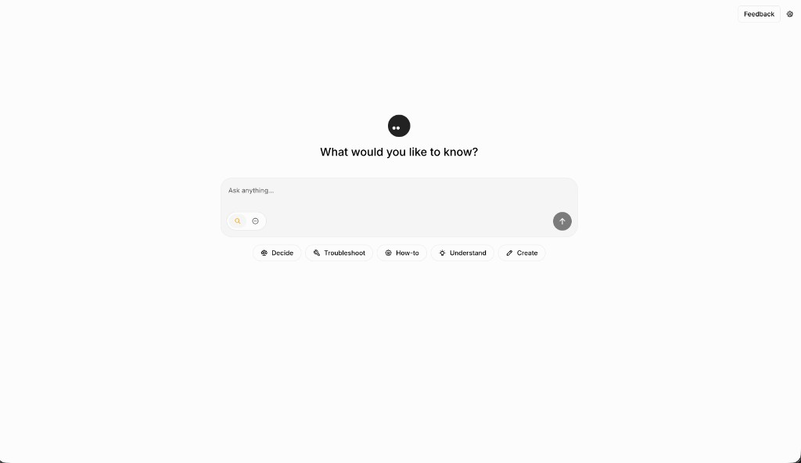
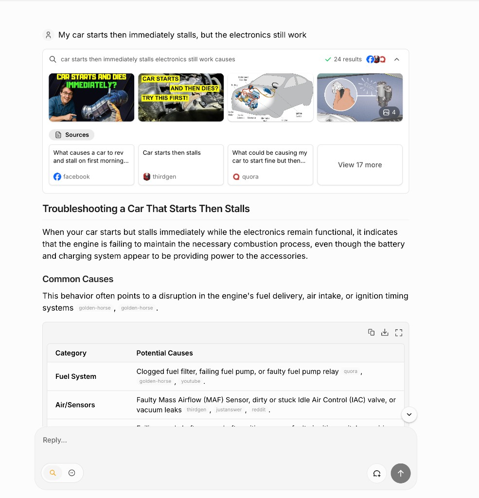

# Morphic

> AI-powered search with a generative UI, deployed on Render with Exa neural search and managed PostgreSQL

<a href="https://render.com/deploy?repo=https://github.com/render-examples/morphic">
  
</a>

[Morphic](https://github.com/miurla/morphic) is an open-source AI search engine: grounded answers, cited sources, and rich inline components streamed from the model. This Render example wires Morphic for a minimal production stack (Docker web service + Postgres + Exa) without self-hosted SearXNG or Redis.





## Table of Contents

- [What This App Does](#what-this-app-does)
- [What This Demonstrates](#what-this-demonstrates)
- [Architecture](#architecture)
- [Deploy to Render](#deploy-to-render)
- [Configuration](#configuration)
- [Troubleshooting](#troubleshooting)
- [Upstream Documentation](#upstream-documentation)
- [License](#license)

---

## What This App Does

Users ask research-style questions in a chat UI. Morphic searches the web via [Exa](https://exa.ai/), calls an LLM (Anthropic, OpenAI, Google, or others), and streams back a cited answer with optional generative UI blocks (images, grids, follow-ups).

### User experience

1. **Ask a question** — e.g. "What are the latest Postgres 17 features?"
2. **Pick a model** — the selector shows providers you configured via API keys
3. **Get cited answers** — sources, summaries, and structured components inline
4. **Return later** — chat history persists in PostgreSQL (anonymous mode by default)

### Key features

- **Exa search** — neural web search without running SearXNG yourself
- **Generative UI** — streamed JSON spec renders rich components beyond markdown
- **Multi-provider LLMs** — OpenAI, Anthropic, Google, Ollama, Vercel AI Gateway
- **Quick and Adaptive search modes**
- **Shareable chat URLs** and optional Supabase auth (disabled in this example)

---

## What This Demonstrates

### Render capabilities

- **Web Service (Docker)** — multi-stage Dockerfile builds Next.js 16; migrations run on container start
- **Managed PostgreSQL** — chat history via Drizzle ORM; `DATABASE_URL` wired from the database resource
- **Blueprint (`render.yaml`)** — one project, one environment, env group for shared config
- **Environment groups** — non-secret defaults (`SEARCH_API=exa`, anonymous mode) in one place

### Why this layout

The upstream Docker Compose stack bundles Postgres, Redis, and SearXNG. This example uses Exa for search and Render Postgres for chat history, so you run two billable resources instead of four services.

---

## Architecture

```
┌─────────────────────────────────────────────────────────────┐
│  Browser                                                     │
│  Next.js 16 app (chat UI, model selector, generative UI)    │
└─────────────────────────────────────────────────────────────┘
                          ↓ HTTPS
┌─────────────────────────────────────────────────────────────┐
│  morphic — Render Web Service (Docker, Standard plan)        │
│  - Next.js API routes (/api/chat, etc.)                      │
│  - Drizzle migrations on boot (docker-entrypoint.sh)         │
└─────────────────────────────────────────────────────────────┘
         ↓                              ↓
┌──────────────────┐          ┌──────────────────┐
│  morphic-db      │          │  Exa API          │
│  Postgres 17     │          │  (SEARCH_API=exa) │
│  chat history    │          └──────────────────┘
└──────────────────┘                    ↓
                               ┌──────────────────┐
                               │  LLM provider     │
                               │  (Anthropic, etc.)│
                               └──────────────────┘
```

| Resource | Plan | Role |
|----------|------|------|
| `morphic` | Standard | Docker web service from [`./Dockerfile`](./Dockerfile) |
| `morphic-db` | basic-256mb | PostgreSQL 17 — Drizzle migrations on startup |
| `morphic-render` (env group) | — | Shared non-secret config (`SEARCH_API`, anonymous mode) |

Default region: **oregon** (change in [`render.yaml`](./render.yaml)).

---

## Deploy to Render

### 1. Gather API keys

Before clicking deploy, have these ready:

| Key | Where to get it |
|-----|-----------------|
| `EXA_API_KEY` | [dashboard.exa.ai](https://dashboard.exa.ai/) |
| One LLM key | e.g. [Anthropic](https://console.anthropic.com/settings/keys), [OpenAI](https://platform.openai.com/api-keys), or [Google AI](https://aistudio.google.com/apikey) |

You can set the LLM key at Apply or in the Dashboard after the first deploy. Do not leave placeholder values like `REPLACE_ME`.

### 2. One-click deploy

<a href="https://render.com/deploy?repo=https://github.com/render-examples/morphic">
  
</a>

Render reads [`render.yaml`](./render.yaml) and provisions:

- PostgreSQL database (`morphic-db`)
- Docker web service (`morphic`) in project **`morphic`**
- Environment group **`morphic-render`** (search provider, anonymous mode, TLS workaround for managed Postgres)

On **Apply**, enter `EXA_API_KEY`. Optionally add an LLM key now; otherwise add it on the `morphic` service **Environment** page after deploy.

First deploy typically takes **5–10 minutes** (Docker build + Next.js compile + migrations).

### 3. After deploy

1. Open the **`morphic`** service URL from the Dashboard.
2. If the model selector is empty, add `ANTHROPIC_API_KEY`, `OPENAI_API_KEY`, or `GOOGLE_GENERATIVE_AI_API_KEY` on the service and redeploy if needed.
3. Run a test query. Check **Logs** for migration success (`Migrations completed`) and search errors.

#### Environment group

| Group | Contents | Linked to |
|-------|----------|-----------|
| **`morphic-render`** | `SEARCH_API=exa`, `ENABLE_AUTH=false`, `ANONYMOUS_USER_ID`, `NODE_TLS_REJECT_UNAUTHORIZED=0` | `morphic` web service |

`DATABASE_URL` and `DATABASE_RESTRICTED_URL` are injected per-service from `morphic-db` (database links cannot live in env groups).

`NODE_TLS_REJECT_UNAUTHORIZED=0` is required for Render's managed Postgres TLS with upstream Morphic's strict Node TLS verification. Prefer fixing verification in application code for production hardening.

### 4. Estimated cost (Oregon)

| Resource | ~USD/mo |
|----------|--------:|
| `morphic` (Standard) | 25 |
| `morphic-db` (basic-256mb) | 6 |
| **Render subtotal** | **~31** |

Exa and LLM usage are billed separately by those providers.

---

## Configuration

### Required secrets

| Variable | Purpose |
|----------|---------|
| `EXA_API_KEY` | Exa neural search |
| One LLM key | `ANTHROPIC_API_KEY`, `OPENAI_API_KEY`, or `GOOGLE_GENERATIVE_AI_API_KEY` |

### Wired automatically

| Variable | Source |
|----------|--------|
| `DATABASE_URL` | `morphic-db` connection string |
| `DATABASE_RESTRICTED_URL` | Same Postgres instance |
| `SEARCH_API` | `exa` (env group) |
| `ENABLE_AUTH` | `false` — anonymous single-user mode |
| `ANONYMOUS_USER_ID` | `anonymous-user` |

### Optional overrides

See upstream [CONFIGURATION.md](https://github.com/miurla/morphic/blob/main/docs/CONFIGURATION.md):

- **Multi-user auth:** `ENABLE_AUTH=true` + Supabase env vars
- **Different search:** `SEARCH_API=tavily` + `TAVILY_API_KEY`
- **File uploads:** Cloudflare R2 / S3-compatible vars
- **Rate limiting:** `MORPHIC_CLOUD_DEPLOYMENT=true` + Upstash Redis

---

## Troubleshooting

| Problem | Fix |
|---------|-----|
| Deploy stuck / health check fails | Check logs for OOM. Starter (512 MB) is often too small; this Blueprint uses **Standard**. |
| "No open ports detected" | Process died before binding `$PORT`. Check build logs and bump plan if OOM. |
| Search errors | Confirm `EXA_API_KEY` and `SEARCH_API=exa`. |
| "We could not generate a response" | Set a real LLM API key. Remove any placeholder `OPENAI_API_KEY=REPLACE_ME`. |
| No chat history | Confirm `morphic-db` is **Available** and migrations completed in logs. |
| Postgres SSL errors | Ensure `NODE_TLS_REJECT_UNAUTHORIZED=0` is set via the `morphic-render` env group. |

Report app bugs upstream: [miurla/morphic issues](https://github.com/miurla/morphic/issues)  
Report this example's deploy wiring: [render-examples/morphic issues](https://github.com/render-examples/morphic/issues)

---

## Upstream Documentation

This repo tracks [miurla/morphic](https://github.com/miurla/morphic) with Render-specific [`render.yaml`](./render.yaml) and the example README above.

- [Configuration](https://github.com/miurla/morphic/blob/main/docs/CONFIGURATION.md)
- [Live demo (upstream)](https://chat.morphic.sh)
- [Live demo (Render)](https://morphic-us8x.onrender.com/)

---

## License

- **Morphic application:** [Apache-2.0](https://github.com/miurla/morphic/blob/main/LICENSE) (upstream)
- **Render example wiring:** same as upstream unless noted otherwise in this repo
