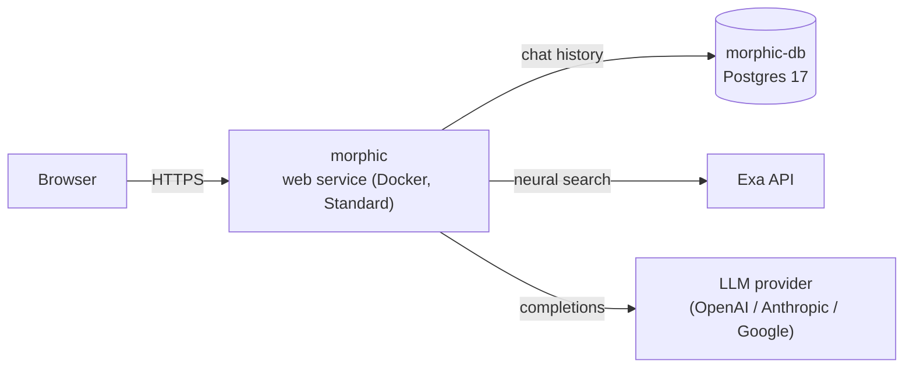

# Morphic on Render

> An AI answer engine with a generative UI: ask a question, get a cited answer streamed back with rich inline components, backed by Exa neural search and managed Postgres.

[](https://render.com/deploy-template/api/github/start?template_repo=morphic)

This template deploys [Morphic](https://github.com/miurla/morphic) on Render as a Docker web service plus a managed PostgreSQL database. It swaps the upstream Docker Compose stack (self-hosted Postgres, Redis, and SearXNG) for [Exa](https://exa.ai/) search and Render Postgres, so you run two billable resources instead of four containers. Bring one Exa key and one LLM key and you have a private, persistent AI search app on your own domain.


---

## Table of contents

- [Why deploy Morphic on Render](#why-deploy-morphic-on-render)
- [Use cases](#use-cases)
- [What gets deployed](#what-gets-deployed)
- [Quickstart](#quickstart)
- [Configuration](#configuration)
- [Cost breakdown](#cost-breakdown)
- [Customization](#customization)
- [Operations](#operations)
- [Upgrading](#upgrading)
- [Troubleshooting](#troubleshooting)
- [FAQ](#faq)
- [Security](#security)
- [Caveats and limitations](#caveats-and-limitations)
- [Credits and license](#credits-and-license)

---

## Why deploy Morphic on Render

- **Two resources, not four:** the upstream Compose file runs Postgres, Redis, and SearXNG alongside the app. This template uses Exa for search and Render's managed Postgres for chat history, so there is no Redis or search container to babysit.
- **Chat history wired for you:** `DATABASE_URL` is injected from the `morphic-db` Postgres instance via a Blueprint reference. You never copy a connection string.
- **Standard plan by default:** Morphic builds Next.js 16 and runs migrations on boot. The Blueprint ships the `standard` (2 GB) plan because `starter` (512 MB) OOMs during the Next.js build and start, which shows up as "No open ports detected".
- **One project in your dashboard:** the web service, database, and env group land in a single named Render project instead of loose resources scattered across your workspace.

## Use cases

What people build with this template:

- **A private research assistant:** ask multi-step questions and get answers with real citations, kept off shared SaaS chat tools.
- **A team knowledge search page:** put it on an internal subdomain so your team searches the web through one shared, logged endpoint.
- **A generative-UI demo:** show off streamed components (image grids, follow-up chips, structured answers) on top of your own model keys.
- **A provider comparison harness:** wire OpenAI, Anthropic, and Google keys at once and switch models per query from the selector.

## What gets deployed



| Resource | Type | Plan | Purpose |
|----------|------|------|---------|
| `morphic` | Web service (Docker) | Standard | Next.js 16 app: chat UI, API routes, migrations on boot |
| `morphic-db` | PostgreSQL 17 | basic-256mb | Persists chat history and shared chats |
| `morphic-render` | Env group | : | Shared non-secret config (search provider, anonymous mode, TLS flag) |

Region: **oregon** (override the `region` fields in [`render.yaml`](./render.yaml) if you want another one; keep the web service and database in the same region so they talk over the private network).

Exa and your LLM provider are external APIs. They are billed by those providers, not by Render.

## Quickstart

1. Click **[Deploy to Render](https://render.com/deploy-template/api/github/start?template_repo=morphic)**. Render forks this template into your GitHub account and reads [`render.yaml`](./render.yaml).
2. Get an Exa key from [dashboard.exa.ai](https://dashboard.exa.ai/) and at least one LLM key (see [Required secrets](#required-secrets)).
3. On the Apply screen, enter `EXA_API_KEY`. Optionally paste an LLM key now, or add it on the service after the first deploy.
4. Click **Apply**. The first deploy takes about **5 to 10 minutes** (Docker build, Next.js compile, then Drizzle migrations on container start).
5. When the `morphic` service is **Live**, open its `*.onrender.com` URL and run a query.

If the model selector is empty on first load, you have not set an LLM key yet. Add one on the `morphic` service (see below) and Morphic detects available models automatically.

## Configuration

### Required secrets

You set these during the Apply step, or on the `morphic` service afterward. A missing Exa key means search returns errors; a missing LLM key means the model selector is empty.

| Env var | What it's for | How to get it |
|---------|---------------|---------------|
| `EXA_API_KEY` | Neural web search (the Blueprint sets `SEARCH_API=exa`) | [dashboard.exa.ai](https://dashboard.exa.ai/) |
| One LLM key | Answer generation. Set **one** of the keys below. | provider console (links below) |

Pick one LLM provider to start (you can add more later):

| Env var | Provider | Where to get it |
|---------|----------|-----------------|
| `OPENAI_API_KEY` | OpenAI | [platform.openai.com/api-keys](https://platform.openai.com/api-keys) |
| `ANTHROPIC_API_KEY` | Anthropic Claude | [console.anthropic.com](https://console.anthropic.com/settings/keys) |
| `GOOGLE_GENERATIVE_AI_API_KEY` | Google Gemini | [aistudio.google.com/apikey](https://aistudio.google.com/apikey) |
| `AI_GATEWAY_API_KEY` | Vercel AI Gateway (multi-provider) | [vercel.com/ai-gateway](https://vercel.com/docs/ai-gateway) |

The LLM keys are not declared in `render.yaml`. Morphic supports many providers and only needs one, so forcing a specific key at Apply would be wrong. Add whichever you use on the `morphic` service → **Environment**. Do not leave placeholder values like `REPLACE_ME`: an invalid key fails at request time with "We could not generate a response".

### Auto-generated secrets

**None.** This template does not generate any secrets. Morphic in anonymous mode does not sign sessions, so there is no secret to create or rotate.

### Wired automatically from other resources

The Blueprint sets these for you. You never type them.

| Env var | Source |
|---------|--------|
| `DATABASE_URL` | `morphic-db` connection string (`fromDatabase`) |
| `DATABASE_RESTRICTED_URL` | Same `morphic-db` instance (upstream reads both) |

Database references cannot live in an env group, so these are attached directly to the `morphic` service in `render.yaml`.

### Optional tweaks

Common changes after deploying. All are env vars you add or override on the `morphic` service or in `render.yaml`. The Blueprint's `morphic-render` env group already sets the defaults in the first four rows.

| Env var | Default | What it does |
|---------|---------|--------------|
| `SEARCH_API` | `exa` | Search backend. `tavily`, `firecrawl`, or `searxng` are also supported (each needs its own key). |
| `ENABLE_AUTH` | `false` | `true` turns on multi-user Supabase auth (see Customization). |
| `ANONYMOUS_USER_ID` | `anonymous-user` | The shared user id all chats belong to in anonymous mode. |
| `NODE_TLS_REJECT_UNAUTHORIZED` | `0` | Required for Render's managed Postgres TLS with upstream's strict Node verification. See [Security](#security). |
| `TAVILY_API_KEY` | : | Set with `SEARCH_API=tavily` to use Tavily instead of Exa. |
| `NODE_ENV` | `production` | Standard Next.js production flag. |

Full upstream config reference: [Morphic CONFIGURATION.md](https://github.com/miurla/morphic/blob/main/docs/CONFIGURATION.md).

## Cost breakdown

| Resource | Plan | Monthly cost |
|----------|------|--------------|
| `morphic` | Standard | $25 |
| `morphic-db` | basic-256mb | $6 |
| **Total** | | **$31** |

Render's full pricing: [render.com/pricing](https://render.com/pricing). Exa and your LLM provider bill you separately for usage.

- **Cheaper:** drop the web service to `starter` only if you also reduce the build footprint; by default `starter` OOMs on the Next.js build, so `standard` is the realistic floor for this app. The database can stay on `basic-256mb`.
- **Scale up:** bump the `morphic` plan for more memory and CPU under heavy concurrent search, and move `morphic-db` to a larger plan (or add a high-availability standby) as chat history grows.

## Customization

### Pin the upstream version

This template tracks the upstream default branch through the files committed in this repo. To lock the app to a known-good commit, check out that commit of [miurla/morphic](https://github.com/miurla/morphic) into your fork before deploying, or keep your fork on a branch you control and merge upstream deliberately. The Docker build always uses the code in your fork, so your fork is the version pin.

### Add a custom domain

In the Render dashboard, open the `morphic` service → **Settings** → **Custom Domains** → **Add**. Render issues and renews TLS automatically. DNS setup is documented at [Render custom domains](https://render.com/docs/custom-domains).

### Switch search providers

Exa is the default. To use Tavily instead:

```yaml
# render.yaml, in the morphic-render env group
- key: SEARCH_API
  value: tavily
```

Then add `TAVILY_API_KEY` as a `sync: false` secret on the service. Firecrawl (`FIRECRAWL_API_KEY`) and self-hosted SearXNG work the same way. Only the provider matching `SEARCH_API` needs a key.

### Enable multi-user auth (Supabase)

Anonymous mode is on by default: everyone shares one user id and there are no logins. To run Morphic for multiple accounts, set `ENABLE_AUTH=true` and add the Supabase env vars from the [upstream auth docs](https://github.com/miurla/morphic/blob/main/docs/CONFIGURATION.md):

```yaml
- key: ENABLE_AUTH
  value: "true"
- key: NEXT_PUBLIC_SUPABASE_URL
  sync: false
- key: NEXT_PUBLIC_SUPABASE_PUBLISHABLE_KEY
  sync: false
- key: SUPABASE_SECRET_KEY
  sync: false
```

### Turn on file uploads

Morphic supports Cloudflare R2 / S3-compatible uploads when the `R2_*` and `S3_ENDPOINT` vars are set. Leave them unset to keep uploads disabled. See [.env.example](./.env.example) for the full list.

## Operations

### Backups

`morphic-db` gets Render's automatic daily Postgres backups with point-in-time recovery on paid plans. Chat history lives entirely in Postgres, so the database backup is your recovery point. There is no persistent disk on the web service, and nothing on the container filesystem needs backing up (it is rebuilt on every deploy).

### Monitoring

Open the `morphic` service in the dashboard for CPU, memory, and request metrics. The Blueprint sets `healthCheckPath: /`, so Render marks a deploy healthy only after the app answers on `/`. Watch memory during the first few deploys: if it climbs toward the plan ceiling, that is the OOM signal to keep it on `standard` or larger.

### Scaling

The web service is stateless (all state is in Postgres), so it scales horizontally. Raise `scaling.numInstances` or configure autoscaling on the `morphic` service. Zero-downtime deploys work because there is no disk pinning the service to one instance. The database is single-primary; add a read replica or HA standby from the database page if you need it.

### Logs

In the Render dashboard, open the `morphic` service → **Logs**. On first deploy, confirm the migration line (Drizzle reports completed migrations) and that the server bound to `$PORT`. CLI: `render logs --resources <service-id> --tail`.

## Upgrading

### Pick up upstream releases

This repo is a fork of the Morphic source plus a Render `render.yaml`. To pull in new upstream work:

1. Add the upstream remote once: `git remote add upstream https://github.com/miurla/morphic.git`.
2. `git fetch upstream && git merge upstream/main` (resolve conflicts, most likely in `Dockerfile`, `package.json`, or config).
3. Push to your fork. Render auto-deploys the new commit.

Keep your `render.yaml` and this README during the merge; they do not exist upstream.

### Breaking-change migrations

Watch the upstream [changelog and releases](https://github.com/miurla/morphic/releases) before merging across major versions. Notable things to check:

- **Schema changes:** Morphic runs Drizzle migrations on container start, so a schema change deploys automatically. Take a database backup before a major upgrade so you can roll back.
- **Env var renames:** if upstream renames or adds a required variable, update the `morphic-render` group or the service env vars to match.

## Troubleshooting

### Deploy fails during the Docker build

Check the deploy logs under **Events**. The most common cause is memory pressure during the Next.js build. This template already uses the `standard` plan for that reason; if you lowered it to `starter`, the build or start step gets OOM-killed and the deploy fails. Restore `plan: standard` in `render.yaml`.

### Service starts but the health check fails ("No open ports detected")

The process died before binding `$PORT`, almost always an out-of-memory kill during Next.js startup on an undersized plan. Bump the plan back to `standard` (or larger) and redeploy. Confirm in the logs that the server prints its listening line and that migrations completed first.

### Search returns errors

Confirm `EXA_API_KEY` is set on the `morphic` service and that `SEARCH_API=exa` (it is, via the env group). If you switched `SEARCH_API`, make sure the matching provider key is set.

### "We could not generate a response"

No valid LLM key. Add one of `OPENAI_API_KEY`, `ANTHROPIC_API_KEY`, `GOOGLE_GENERATIVE_AI_API_KEY`, or `AI_GATEWAY_API_KEY` on the service and remove any placeholder value. The model selector populates once a working key is present.

### Postgres SSL / self-signed certificate errors

Ensure `NODE_TLS_REJECT_UNAUTHORIZED=0` is set (the `morphic-render` env group sets it). Upstream Morphic uses strict Node TLS verification, and Render's internal Postgres URL presents a platform CA that Node rejects without this flag. See [Security](#security) for the hardening note.

### No chat history

Confirm `morphic-db` is **Available** and that the migration line appears in the `morphic` logs. If migrations did not run, the tables do not exist yet and history cannot persist.

### Anything else

- Service-level logs: dashboard → **Logs** (or `render logs --resources <id> --tail`)
- Deploy-level logs: dashboard → **Events** → click the failed deploy
- Template wiring bugs: open an issue in [render-examples/morphic](https://github.com/render-examples/morphic/issues)
- Application bugs: open an issue [upstream](https://github.com/miurla/morphic/issues)

## FAQ

### Can I run this on Render's free plan?

Not comfortably. The Next.js build and runtime need more than the free/`starter` 512 MB, and free Postgres expires after 30 days. Use `standard` for the web service and a paid `basic-256mb` database for anything you want to keep.

### Do I have to enter an LLM key at deploy time?

No. Only `EXA_API_KEY` is prompted at Apply. Add an LLM key on the service whenever you are ready; Morphic detects available models from whatever keys are present.

### Can I use a different search provider than Exa?

Yes. Set `SEARCH_API` to `tavily`, `firecrawl`, or `searxng` and add that provider's key. See [Switch search providers](#switch-search-providers).

### Where is my chat history stored?

In the `morphic-db` Postgres database, not on the container. Redeploys and restarts do not lose it. Deleting the database deletes the history.

### Is this multi-user?

By default no: it runs in anonymous single-user mode where everyone shares one user id. Enable Supabase auth to support real accounts (see [Customization](#enable-multi-user-auth-supabase)).

### How is this different from the upstream Docker Compose setup?

Upstream bundles Postgres, Redis, and SearXNG as containers. This template uses Render's managed Postgres and the hosted Exa API, and drops Redis. Fewer moving parts, and the database is backed up for you.

## Security

- **Encryption at rest:** `morphic-db` (managed Postgres) is encrypted at rest by Render, including backups.
- **Encryption in transit:** TLS terminates at the `*.onrender.com` hostname, and traffic to `morphic-db` uses Render's private network.
- **Network exposure:** only the `morphic` web service is public. The database is reachable over the private network from the web service and is not exposed publicly (`ipAllowList: []`).
- **`NODE_TLS_REJECT_UNAUTHORIZED=0`:** this disables Node's TLS certificate verification process-wide inside the container. It is set to make upstream's strict verification work with Render's internal Postgres CA without patching app code. It affects only server-side Node calls inside your container, not the browser-facing TLS. For production hardening, fix certificate verification in the app's database layer and remove this flag.
- **Secret rotation:** `EXA_API_KEY` and LLM keys are safe to rotate anytime (update the value on the service and redeploy). There are no generated secrets to worry about.
- **Reporting vulnerabilities:** template wiring issues → [this repo](https://github.com/render-examples/morphic/issues); application issues → [upstream](https://github.com/miurla/morphic/security).

## Caveats and limitations

- **`NODE_TLS_REJECT_UNAUTHORIZED=0` is a tradeoff.** It relaxes TLS verification inside the container to connect to Render Postgres without app changes. Harden this before treating the deploy as production-grade (see [Security](#security)).
- **`starter` is not enough.** The Next.js build OOMs on 512 MB, so `standard` is the practical minimum for the web service. This is why the Blueprint does not default to `starter`.
- **This is a fork, not a thin wrapper.** The full Morphic source lives in this repo, so upgrading means merging upstream and resolving conflicts rather than bumping an image tag.
- **Anonymous mode by default.** Every visitor shares one user id and one history until you enable auth. Do not put it on a public URL expecting per-user privacy.
- **Single region.** The web service and database default to `oregon`. Multi-region read replicas are a Render Postgres feature you configure separately.

## Credits and license

- **Upstream:** [miurla/morphic](https://github.com/miurla/morphic) : Apache-2.0
- **This template:** a fork of the upstream source plus a Render `render.yaml` and this README, distributed under the same [Apache-2.0 license](./LICENSE).
- **Template maintainer:** [ojusave](https://github.com/ojusave)

If this template helped you, star the [upstream Morphic repo](https://github.com/miurla/morphic).
